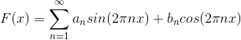
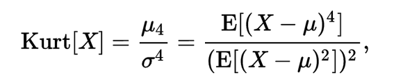
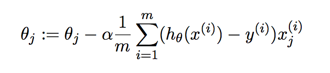
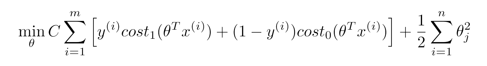

#HSLIDE

## Przewidywanie ataków padaczki
Konkurs na Kaggle: [https://www.kaggle.com/c/melbourne-university-seizure-prediction](https://www.kaggle.com/c/melbourne-university-seizure-prediction)

#HSLIDE

* ~6000 obserwacji w zbiorze treningowym.
* Każda obserwacja to 16-kanałowy 10-minutowy sygnał EEG.
* Każdy kanał to 240k wartości.
* 3 pacjentów
* Obserwacje podzielone na dwie grupy: przedatakowe i nie-przedatakowe.

#HSLIDE

## EEG

#HSLIDE

## Widmo sygnału
* Szereg 
* Szybka transformata Fouriera
* Moduł ze współczynników -> widmo
* Liczenie FFT dla każdego otoczenia punktu -> spektrogram

#HSLIDE

### Spektrogram 1/3

#HSLIDE

### Spektrogram 2/3

#HSLIDE

## Spektrogram 3/3

Niestety, nie możemy wykorzystać całego potencjału spektrogramu, gdyż:

* Widmo, to wektor o rozmwiarze 120k
* Więc spektrogram to macierz 240k * 120k ~ 26GB

#HSLIDE

## Features

* Statystyki sygnału: min, max, średnia, wariancja, wsp. skośności, kurtoza 
* Macierz korelacji sygnałów i jej wektory własne
* Macierz korelacji widma (współczynników FFT) i jej wektory własne
* Power-in-Band Spectral Entropy
* Higuchi fractal dimension
* Petrosian fractal dimension
* Odsetek zer (błędów) w danych

#HSLIDE

## Wsp. skośności (ang. skewness)

#HSLIDE

## Kurtoza

#HSLIDE

## Power-in-Band Spectral Entropy

Niech  będzie widmem sygnału.

#HSLIDE

## Higuchi fractal dimension

Wymiarem Higuchi'ego jest nachylenie prostej (tangens), która najlepiej przybliża (ze względu na błąd średnio kwadratowy) kolejne wartości funkcji: 

#HSLIDE

## Petrosian fractal dimension

Gdzie n długość wektora, dla którego jest liczony wymiar.

A  to liczba zmian znaku pochodnej.

#HSLIDE

## Klasyfikatory

* SVM
* Logistic Regression
* XGBoost

#HSLIDE

## Logistic Regression

#HSLIDE

## Support Vector Machine

#HSLIDE

## XGBoost

#HSLIDE

## Główne problemy nr 1

Cross-validacja - dane testowe zostały wygenerowane kilkanaście miesięcy po danych treningowych, więc istotnie różniły się, dlatego żadne metody cross-validacji nie były miarodajne.

Brak dobrej cross-validacji narażał nas na overfitting. Jednym z wyjść z tej sytuacji był ensambling.

#HSLIDE

## Główne problemy nr 2

Dziury w danych. Metody radzenia sobie:
* wypełnianie ich szumem Gaussowskim
* wypełnianie ich funkcją liniową
* model auto-regresji
* model ARMA (auto-regression moving average)

#HSLIDE

## Auto-regresja 

#HSLIDE

## Moving average

#HSLIDE

## ARMA

#HSLIDE

#Dziękuję za uwagę :)
